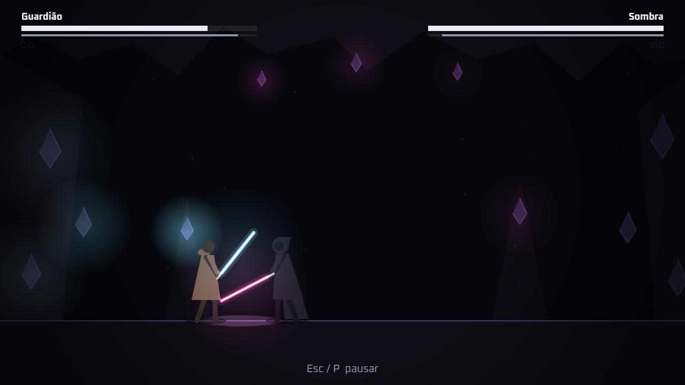
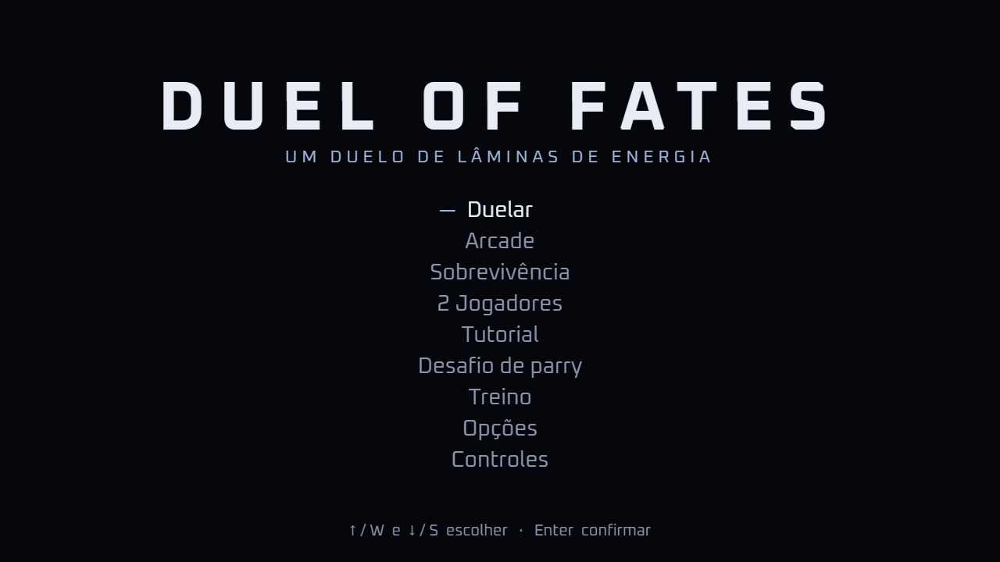
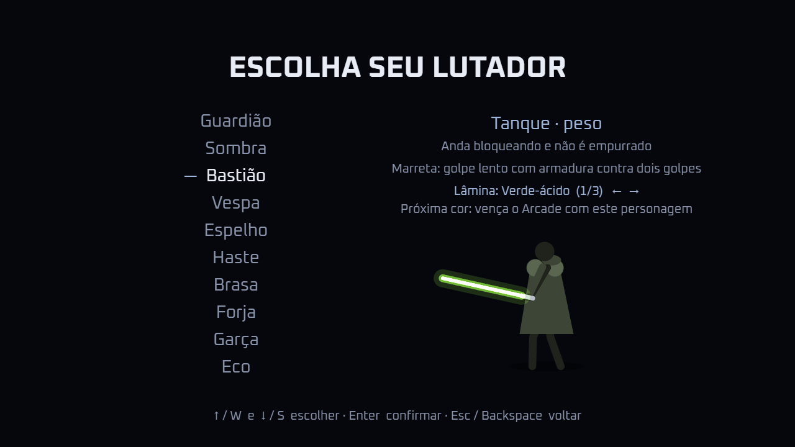
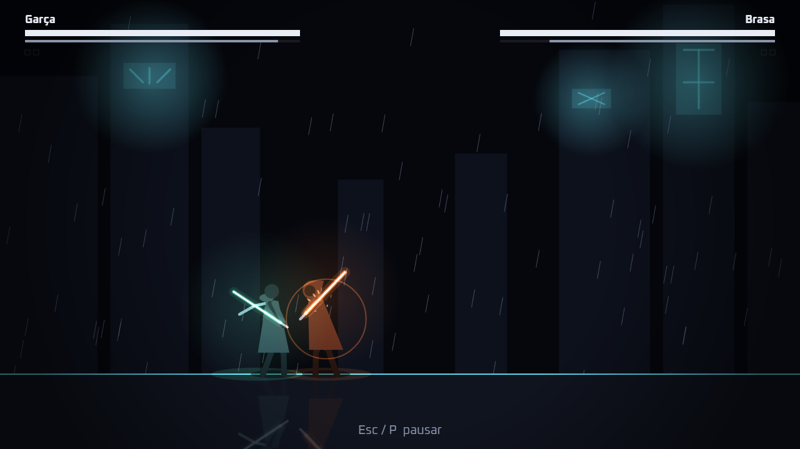

# Duel of Fates — duelo 2D de lâminas de energia

## ⚠️ Aviso Legal / Disclaimer
Este é um projeto estritamente acadêmico e sem fins lucrativos, desenvolvido exclusivamente para fins de portfólio e aprendizado. 
Os conceitos de "A Força" e mecânicas de duelo contidos aqui são inspirados na franquia Star Wars, de propriedade da Lucasfilm Ltd. e Walt Disney Company. 
Não há intenção de violação de direitos autorais. Todo o código e implementação lógica são de autoria própria.

**Academic Project / Prototype**

Jogo 2D de duelo de lâminas de energia para navegador, feito com HTML5, CSS3, JavaScript puro (ES Modules) e Canvas 2D. Sem frameworks, sem engine e sem bundler.

> Projeto acadêmico, sem fins comerciais, inspirado nos duelos de sabre de Star Wars. Não é um produto oficial e não tem afiliação com a Lucasfilm ou a Disney. O código usa termos neutros e não inclui assets oficiais, para que o jogo possa receber uma identidade própria no futuro (ver [DESIGN.md](DESIGN.md#propriedade-intelectual)).



| | |
| --- | --- |
|  |  |
|  | |

## O que tem no jogo

- **10 personagens** com atributos (seis notas de 1 a 9), golpes, habilidade, alinhamento e IA próprios: Guardião, Sombra, Bastião, Vespa, Espelho, Haste, Brasa, Forja, Garça e Eco. Mais um chefe no Arcade e na Sobrevivência e **dois personagens secretos**, liberados pela História ou por um segredo na tela de abertura.
- **6 arenas** desenhadas por código: Plataforma de Refino, Santuário Alagado, Mina de Cristal, Telhado Neon, Anel Orbital e Floresta Lumínica.
- **Combate por timing**: rápido, forte, bloqueio, parry e parry perfeito com riposta, empurrão, esquiva (dash) e esquiva de precisão, sequências, golpe aéreo, pulo duplo (Vespa) e habilidade de cada personagem.
- **Poderes do Fluxo** (opcionais): medidor próprio, quatro poderes em dois caminhos (Aurora: Repulsão e Barreira; Eclipse: Raio e Puxão) e resistência pela diferença de nível entre os lutadores.
- **Modos**: **História** (campanha com protagonista criado e evoluído pelo jogador, diálogos, dois finais e um duelo secreto), Duelar (contra a IA, em Fácil, Normal ou Difícil), Arcade, Sobrevivência, 2 Jogadores no mesmo teclado ou com dois controles, Tutorial, Desafio de parry e Treino (boneco configurável, gravação e reprodução de inputs, hitboxes).
- **Apresentação**: abertura com a lâmina acendendo, replay em câmera lenta do golpe final, música e som sintetizados que reagem à luta, cores de lâmina e trajes desbloqueáveis, teclas configuráveis e suporte a gamepad.
- **Celular**: controles de toque (joystick e botões desenhados no jogo), menus por toque, paisagem com safe areas e efeitos reduzidos automáticos.

## Requisitos

- Navegador moderno (Chrome, Edge ou Firefox; toque em paisagem no Android/iOS)
- Node.js 20+ (só para o servidor local e os testes; o jogo não tem dependências)

## Como rodar

ES Modules não carregam via `file://`. Abrir o `index.html` com duplo clique causa erro de CORS. Use o servidor local:

```bash
npm start
```

Depois abra http://localhost:8080.

A porta pode ser alterada com a variável `PORT`:

```bash
PORT=3000 npm start
```

Qualquer outro servidor estático também funciona (`python -m http.server`, Live Server do VS Code etc.).

## Publicar no GitHub Pages

O jogo é um site estático: não tem build, e todos os caminhos são relativos. O arquivo `.nojekyll` faz o Pages servir os arquivos como estão.

1. Envie o repositório para o GitHub.
2. Em **Settings → Pages**, escolha **Deploy from a branch**, a branch `main` e a pasta `/ (root)`.
3. O jogo fica em `https://<usuário>.github.io/<repositório>/`.

As opções e o progresso (teclas, cores desbloqueadas, recorde) ficam no `localStorage` do navegador de cada jogador.

## Testes

```bash
npm test
```

Usa o test runner nativo do Node (`node --test`). Não há dependências para instalar.

Os testes cobrem apenas módulos de lógica. Por isso, módulos de lógica não podem acessar DOM nem Canvas diretamente (ver [ARCHITECTURE.md](ARCHITECTURE.md)).

## Balanceamento

```bash
npm run simulate -- --duels 300 --difficulty normal
```

Roda duelos IA × IA sem navegador e mostra vitórias e estatísticas. `npm run matrix` roda todos contra todos e mostra a média de vitórias de cada personagem. Opções e exemplos em [ARCHITECTURE.md](ARCHITECTURE.md#balanceamento).

## Controles

| Ação | Teclas |
| --- | --- |
| Mover | `A` / `D` ou setas |
| Pular | `W`, seta para cima ou `Espaço` |
| Ataque rápido | `J` |
| Ataque forte | `K` |
| Bloquear (segurar) | `L` |
| Aparar / parry (tocar na hora do golpe) | `L` |
| Riposta (logo depois de aparar) | `J` |
| Empurrar (quebra a defesa) | `L` + `J` |
| Esquivar (dash) | `Shift` |
| Esquiva de precisão | `S` ou seta para baixo |
| Navegar nos menus | `W` / `S` ou setas |
| Confirmar | `Enter` |
| Voltar | `Esc` ou `Backspace` |
| Pausar / voltar ao jogo | `Esc` ou `P` |
| Debug | `F3` |
| Comportamento do boneco (modo Treino); também para a reprodução | `F4` |
| Gravar inputs no Treino | `F5` |
| Reproduzir no boneco | `F6` |
| Hitboxes no Treino, sem F3 | `F7` |

O preset alternativo, selecionável em Opções, usa setas para mover/pular e Z/X/C/V para rápido/forte/guarda/esquiva. A escolha é salva no navegador e a tela de Controles acompanha o preset. Gamepad padrão: stick/direcional para mover, A pular/confirmar, X rápido, Y forte, LB/LT guarda, B esquiva/voltar e Start pausa.

Habilidade do personagem: `I`. Gamepad: ataques nos botões frontais (X rápido, Y forte), guarda em LB/LT, habilidade em RB, poder em RT, esquiva em B, pulo em A.

**Poderes do Fluxo** (opção **Poderes**, ligada por padrão em Duelar, 2 Jogadores e Treino): `U` usa o poder principal do alinhamento (Aurora: Repulsão; Eclipse: Raio, segurando); com direção usa o segundo (trás + `U`: Barreira, segurando; frente + `U`: Puxão). O medidor fica abaixo da stamina. No celular há um botão **Poder**.

**Dois jogadores no mesmo teclado:** J1 usa `W A S D`, `F G H` (rápido, forte, guarda), `T` (habilidade), `R` (poder) e `Shift` esquerdo; J2 usa as setas, `J K L`, `I`, `O` (poder) e `Shift` direito (ou o teclado numérico). Cada jogador também pode usar um controle.

As teclas de luta podem ser trocadas em **Opções → Configurar teclas** (fica salvo no navegador).

A esquiva de precisão evita um golpe com timing curto, sem stamina; se errar o tempo, a recuperação fica vulnerável. A Vespa pode pular uma segunda vez no ar. No teclado numérico do J2, `Numpad2` faz a esquiva de precisão e `Numpad4` aciona o forte.

Os controles ficam em [src/config/controlsConfig.js](src/config/controlsConfig.js).

## Mobile

Use o aparelho em paisagem. Joystick na esquerda; rápido, forte, guarda, esquiva, habilidade e pulo na direita. Arraste para baixo para a esquiva de precisão. Toque uma opção para selecionar e novamente para confirmar. A pausa fica no topo. O manifest permite adicionar à tela inicial; não há suporte offline. QA em Chrome Android e Safari iOS reais ainda depende do autor (versions/v2.md).

## Documentação

| Arquivo | Conteúdo |
| --- | --- |
| [DESIGN.md](DESIGN.md) | Briefing: conceito, sensação, pilares e o que não fazer |
| [design/ART_DIRECTION.md](design/ART_DIRECTION.md) | Identidade visual |
| [design/VISUAL_SYSTEM.md](design/VISUAL_SYSTEM.md) | Cores, tipografia, camadas e regras de renderização |
| [design/UI_GUIDELINES.md](design/UI_GUIDELINES.md) | Interface e HUD |
| [design/VFX_GUIDELINES.md](design/VFX_GUIDELINES.md) | Efeitos visuais |
| [design/REFERENCES.md](design/REFERENCES.md) | Referências |
| [GAME_DESIGN.md](GAME_DESIGN.md) | Regras de gameplay |
| [ARCHITECTURE.md](ARCHITECTURE.md) | Como o código é organizado e como os módulos se comunicam |
| [TASKS.md](TASKS.md) | Índice do roadmap e ponto de continuidade |
| [versions/](versions/) | Tarefas de cada versão (v1 fechada, v2 em andamento, backlog) |
| [AGENTS.md.example](AGENTS.md.example) | Modelo de instruções para agentes de IA (Claude Code, Codex, GPT). Copie para `AGENTS.md` (ignorado pelo git) e personalize |
| [CREDITS.md](CREDITS.md) | Créditos e aviso de marca |
| [ASSETS.md](ASSETS.md) | Origem e licença de cada asset |

## Licença

O código está sob a licença [MIT](LICENSE). A licença cobre apenas o código escrito para este projeto. Marcas e personagens de terceiros não estão incluídos (ver [CREDITS.md](CREDITS.md)).
